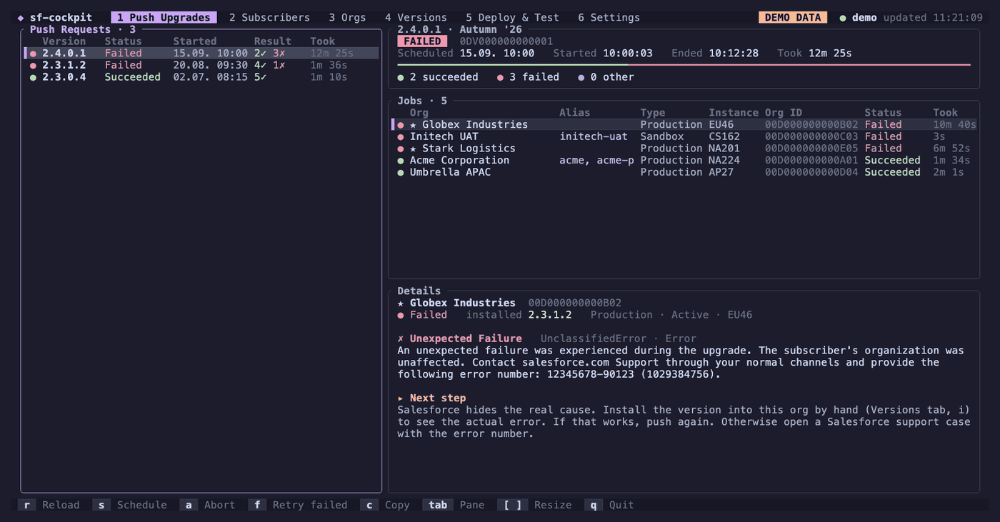

# sf-cockpit — Salesforce push upgrade troubleshooting in your terminal

A free, open-source terminal app for Salesforce ISVs to investigate failed package push upgrades, see
subscriber orgs and their error messages together, and retry failed orgs after addressing the cause.
It uses your existing Salesforce CLI (`sf`) login and puts your release workflow behind one keyboard-
and mouse-driven UI:

- **Push upgrades:** see which orgs failed and why, schedule new pushes, retry failed orgs, abort pending requests.
- **Subscribers:** every org with your package and whether it is behind the latest release. Mark important customer orgs and give orgs your own names.
- **Orgs:** all orgs the `sf` CLI knows, with status, scratch org expiry, duplicate aliases and the installed package version.
- **Versions:** package versions with coverage and subscriber count; copy install links, promote, install, create new versions.
- **Deploy & Test:** deployment history of an org, deploy your project with a live log, run Apex tests and see failures and coverage.
- **Settings:** pick the Dev Hub, package and scratch org from lists, saved straight into your config file.



Every tab opens instantly with the data of the last run and refreshes itself in the background; a spinner next to a tab name shows which tabs are still refreshing.

Every command that changes something shows the exact `sf` command and asks first. Push upgrades, promotions and installs outside your scratch org are marked as dangerous.

**Who it is for:** ISV teams shipping a managed or unlocked package: when a push upgrade fails, Salesforce tells you to query the API for the details. sf-cockpit does those queries and shows the failed orgs with their errors next to each other. The Orgs and Deploy & Test tabs are also useful for any Salesforce developer or consultant working with many scratch orgs and sandboxes, and `--print` gives CI jobs and AI agents the same overview as plain text.

Try it without an org: install it, then run `sf-cockpit --demo`.

Investigating a failed release? Read [How to investigate failed Salesforce package push upgrades](docs/push-upgrade-troubleshooting.md)
for Salesforce CLI and SOQL examples, error interpretation, and retry steps with or without sf-cockpit.

## Install

macOS and Linux:

```bash
curl -fsSL https://raw.githubusercontent.com/ronny-schlidt/sf-cockpit/main/install.sh | sh
```

The installer puts `sf-cockpit` into `~/.local/bin` (change with `SF_COCKPIT_BIN_DIR`). It downloads the prebuilt binary of the latest release and checks its checksum. Without a release for your platform it clones the repository and builds it with cargo, which needs [Rust](https://rustup.rs). From a clone, `./install.sh` builds and installs the local code. No GitHub account is needed; the [GitHub CLI](https://cli.github.com) is used when it is installed.

Windows: download `sf-cockpit-x86_64-pc-windows-msvc.zip` from the [latest release](https://github.com/ronny-schlidt/sf-cockpit/releases/latest), unpack it and put `sf-cockpit.exe` on your `PATH`. Or build it with `cargo install --git https://github.com/ronny-schlidt/sf-cockpit`.

## Updates

The installed version is shown on the Settings tab (and by `sf-cockpit --version`). sf-cockpit checks GitHub for a newer release once a day in the background. When there is one, the top bar shows `↑ 0.4.0 available · N`. Press `N` to read what's new and `Enter` to update: the new binary is downloaded, its checksum checked, and it replaces the running one. Start sf-cockpit again to use it; the first start after an update offers the release notes once more.

From the command line:

```bash
sf-cockpit --check-update     # prints the newer version and its notes; exit code 10 if there is one
sf-cockpit --update           # installs the latest release in place
```

Updates use `gh` when it is installed and logged in, otherwise plain `curl`. Turn the background check off with `SF_COCKPIT_NO_UPDATE_CHECK=1`. Nothing is sent to GitHub except the request for the latest release.

You also need the [Salesforce CLI](https://developer.salesforce.com/tools/salesforcecli) (`sf`), logged in to the Dev Hub that owns your package:

```bash
sf org login web --alias DevHub --set-default-dev-hub
```

## First start

Start `sf-cockpit` inside your Salesforce project folder, where `sfdx-project.json` is. If no Dev Hub is configured yet, sf-cockpit opens its Settings tab: choose the Dev Hub from your orgs, then the package and the scratch org. The choices are saved to `sf-cockpit.toml` in the project, so everyone who clones the project gets them. The Setup box on that tab lists anything still missing, for example when no org is logged in as Dev Hub, or when sf-cockpit was started outside a project.

## Quick start

```bash
sf-cockpit --demo                 # sample data, no org needed
cd ~/my-sfdx-project && sf-cockpit
sf-cockpit --tab orgs             # open a specific tab
sf-cockpit --print --tab push     # plain text for scripts, CI logs and AI agents
```

## Configuration

sf-cockpit reads, from highest to lowest priority:

1. Command-line flags (`--dev-hub`, `--package`, `--limit`, `--org`).
2. `sf-cockpit.toml` in the current directory or a parent directory. Its directory is the project directory.
3. `~/.config/sf-cockpit/config.toml` (or `$XDG_CONFIG_HOME/sf-cockpit/config.toml`).
4. The `sf` CLI config: `target-dev-hub` and `target-org`.
5. `sfdx-project.json`: the package id from `packageAliases`.

```toml
dev_hub = "my-devhub"                             # alias or username
package = "My Package"                            # name or 0Ho id
scratch_org = "my-scratch"                        # default org for deploys, tests and installs
project_dir = "."                                 # relative to this file
source_dir = "force-app"                          # what D deploys
definition_file = "config/project-scratch-def.json"
skip_ancestor_check = false
limit = 30                                        # push requests to load

[orgs.00D5g000001AbCd]                            # subscriber org id, 15 or 18 characters
name = "ACME Production"                          # your own name, shown instead of the org name
important = true                                  # listed first, preselected for push upgrades
```

Unknown keys are an error, so typos do not go unnoticed.

The `[orgs.*]` tables are usually written from the Subscribers tab (`m` marks an org, `e` names it) into the same file as the other settings. Keep them in the project's `sf-cockpit.toml` so your team sees the same names. The subscriber list itself comes from `PackageSubscriber` on the Dev Hub. Only the names and markings are stored locally.

You rarely need to edit these files by hand: the **Settings** tab (`6`) lets you pick `dev_hub`, `package` and `scratch_org` from your orgs and your Dev Hub's packages. It writes into `sf-cockpit.toml` when you started inside a project, otherwise into the global file, and only touches the changed line. The tab also shows where every value comes from. `sf-cockpit --print --tab settings` prints the same overview.

## Cache

The last loaded data of every tab is stored in `~/Library/Caches/sf-cockpit` (macOS), `$XDG_CACHE_HOME/sf-cockpit` or `~/.cache/sf-cockpit`. Only parsed data is stored (org names, usernames, org ids, versions, deployments), never access tokens, and the files are readable only by you. The top bar shows how old the shown data is while it refreshes, and keeps showing it if a refresh fails. Clear it with `C` on the Settings tab.

## Controls

The mouse works everywhere: click tabs, rows and the buttons in the footer, scroll with the wheel, drag the divider on the Push tab, and drag over text to copy it.

| Key | Where | Action |
|---|---|---|
| `1`–`6` | everywhere | Push Upgrades, Subscribers, Orgs, Versions, Deploy & Test, Settings |
| `Tab`, `←` `→` | everywhere | Move between panels |
| `↑` `↓`, `j` `k`, `PgUp` `PgDn`, `g` `G` | everywhere | Move the selection or scroll |
| `r` | everywhere | Reload the current tab (on Settings: all tabs) |
| `L` / `x` | everywhere | Show the log of the last command / cancel the running command |
| `N` | everywhere | What's new: install an available update, or read the notes after one |
| `q`, `Esc` | everywhere | Quit (`Esc` first clears a filter) |
| `s` | Push, Subscribers | Schedule a push upgrade |
| `m` | Subscribers | Mark or unmark the org as important (★) |
| `e` | Subscribers | Give the org your own name (empty removes it) |
| `a` | Push | Abort the selected request (Created or Pending only) |
| `f` | Push | Retry: schedule again for the failed orgs of the selected request |
| `c` | most tabs | Copy details (Orgs: username) |
| `/` | Subscribers, Orgs | Filter |
| `o` / `i` / `I` | Orgs | Open in browser / installed version of the org / of all orgs |
| `C` / `d` | Orgs | Copy org id / delete a scratch org |
| `u` / `U` | Versions | Copy the production / sandbox install link |
| `p` / `i` / `n` | Versions | Promote a beta / install into an org / create a new version |
| `o` / `D` / `t` | Deploy & Test | Choose the org / deploy the project / run Apex tests |
| `Enter`, `e` / `C` | Settings | Change the selected setting / clear the cache |
| `[` `]` | Push | Resize the panels |
| `←` `→`, `Home` `End`, `Backspace`, `Delete` | text fields | Move the caret inside the text and edit anywhere in it |

### Scheduling a push upgrade

`s` opens a four-step wizard: choose the released version, choose the orgs (orgs behind that version are preselected, only the marked ★ ones if you marked any; `a` checks every org behind, `m` only the marked ones, `n` none; orgs already on the version are flagged), choose a start time in UTC or start right away, then confirm. The confirmation shows the exact command. After scheduling, the Push tab selects the new request and refreshes itself every 30 seconds while a request is pending or in progress.

If Salesforce rejects some orgs, `sf` writes `job_errors/push_request_<id>_errors.log` into the project directory and the request can stay in `Created`. Abort it with `a` and schedule again without those orgs.

## Common push upgrade errors

For the complete workflow, see the [push upgrade troubleshooting guide](docs/push-upgrade-troubleshooting.md).

| Error | Meaning | Next step |
|---|---|---|
| `IneligibleUpgrade`: "This package is not yet available" | The new version has not reached the subscriber's instance yet. Common right after promoting. | Push again in a few hours. |
| `IneligibleUpgrade` (other messages) | The package is not installed, a beta is installed, or the org already has this or a newer version. | Check the org on the Subscribers tab. |
| `UnclassifiedError`: "Unexpected Failure" | Salesforce does not reveal the cause. | Install the version into that org by hand (Versions tab, `i`) to see the real error. |
| `ApexTestFailure` | An Apex test failed in the subscriber org. | Fix the test or code and create a new version. |

## What it runs

Reading:

- `sf data query` (Data API): `PackagePushRequest`, `PackagePushJob`, `PackagePushError`, `MetadataPackageVersion`, `PackageSubscriber`
- `sf data query --use-tooling-api`: `Package2` (to filter everything to your package), `DeployRequest`
- `sf org list --all`, `sf package installed list`, `sf package version list --verbose`
- Local aliases from `~/.sfdx/alias.json`

Writing, always after a confirmation:

- `sf package push-upgrade schedule` / `abort`
- `sf package version promote` / `create`, `sf package install`
- `sf project deploy start`, `sf apex run test`
- `sf org open`, `sf org delete scratch`

Nothing leaves your machine except through the `sf` CLI, apart from the daily update check against GitHub (see [Updates](#updates)). The output of `sf org open` is never shown or stored, because it contains a session id.

## Troubleshooting

- **"could not run `sf`"**: install the Salesforce CLI and make sure `sf --version` works in the same terminal.
- **"sObject type 'PackagePushRequest' is not supported"**: the Dev Hub is not the owner of your package, or push upgrades are not enabled. Check `dev_hub`.
- **"package ... not found"**: `package` must be the exact package name or the `0Ho` id from `sfdx-project.json`.
- **Loading takes several seconds**: every query starts the `sf` CLI. The Push tab runs six queries in parallel.
- **No colors or broken borders**: use a terminal with true color and Unicode, for example iTerm2, WezTerm, Ghostty, Kitty or Windows Terminal.

## Uninstall

sf-cockpit is a single file. It installs nothing in your orgs and runs no background service. Remove the binary, and if you like, its cache and global config:

```bash
rm ~/.local/bin/sf-cockpit            # or wherever SF_COCKPIT_BIN_DIR pointed
rm -rf ~/Library/Caches/sf-cockpit    # cache on macOS
rm -rf ~/.cache/sf-cockpit            # cache on Linux ($XDG_CACHE_HOME/sf-cockpit if set)
rm -rf ~/.config/sf-cockpit           # global config ($XDG_CONFIG_HOME/sf-cockpit if set)
```

On Windows (PowerShell), delete `sf-cockpit.exe` where you put it and remove that folder from your `PATH`, then:

```powershell
Remove-Item "$HOME\.cache\sf-cockpit", "$HOME\.config\sf-cockpit" -Recurse -ErrorAction SilentlyContinue
```

Left alone on purpose: `sf-cockpit.toml` in your projects (it may be shared with your team through git), the Salesforce CLI with its org logins, and the `job_errors/` logs that `sf` writes.

## Development

```bash
cargo run -- --demo
cargo test                                   # render, input, parsing and command tests, no org needed
cargo clippy --all-targets -- -D warnings
```

To release: bump `version` in `Cargo.toml`, commit, then push a tag like `v0.3.0` (`git tag v0.3.0 && git push origin v0.3.0`). That builds binaries for macOS, Linux and Windows and creates a GitHub release with generated notes; running copies offer the update within a day.

Built with [Ratatui](https://ratatui.rs). Colors: [Catppuccin Mocha](https://catppuccin.com).

## Feedback and contributing

Bug reports, ideas and pull requests are welcome: [open an issue](https://github.com/ronny-schlidt/sf-cockpit/issues). If a push upgrade fails with an error that is not in the table above, please share the error code and message (without org ids) so it can be explained there.

## License

[MIT](LICENSE). Not affiliated with or endorsed by Salesforce, Inc. Salesforce is a trademark of Salesforce, Inc.

Made by [Ronny Schlidt](https://github.com/ronny-schlidt), who uses it to ship [bowbridge Anti-Virus for Salesforce](https://appexchange.salesforce.com/appxListingDetail?listingId=c3915cd5-fd7a-4915-91aa-22cd7c6a0cfa) on AgentExchange.
